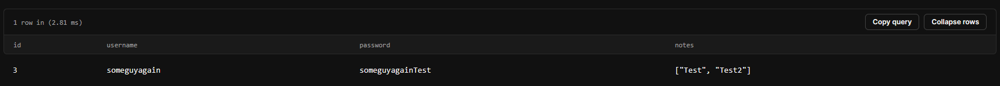

# Notes-Software
This is a description of my notes software and how it was made the timeline what lead up what's the purpose. Other information.

<h1> The Starting Point </h1>

I started working on this project on 12/03/2024 (DD/MM/YEAR) I started this project as I wanted to move from basic python software to more open enviroment in this case .NET C# Software making for prior knowledge I have done work in C# not a lot I did pass an introduction course for it but it did not include graphical aspects inside of said course this was more for general knowledge get you basics so I was diving into the deep end for C#. I have prior knowledge in SQL before this and had tampered around quite a lot beforehand I'm also fully aware of issues what may arise from SQL for example SQL Injections one of common OWASP Vulnerabilities I accounted for this as I do CTF's capture the flag on hackthebox a online website to learn ethical hacking.

<h1> What's The Point? </h1>

I made this repo and this software to show proof of knowledge and where motivation can take you in terms of things, I also want to show this to my college tutors as programming is huge passion of mine and want to show that <b> I truly care </b> there's many people which will do a course for the sake of a degree what they can throw down on a CV but I want this to show effort I'm willing to put in to master the skill's I have worked on fondly for 7 Years. I don't have the best vocabulary or grammar skills so some of this will be poorly worded and I'm fully accepting of this and want to use this as working off point to become better at write-up's and other skills such as software development.

<h1> Skills I Wish To Develop </h1>

<ul>
  <li>My scripting proficiency</li>
  <li>Problem solving</li>
  <li>Motivation</li>
</ul>

<h1> Specifications </h1>
Server Hoster: Planetscale <br>
Database Type: SQL

<h1> Timeline </h1>

<b> Started on 12/03/2024 </b>

```
12/03/2024 15:59 BST
Introduction

Software production started to clarify the Github was not made at this concurrent time the first thing
I began to work on was thelogin page keeping an ease colour on the person's eye's so I targeted colour
scheme of grey to dark-grey, lighter grey for fore-colour and dark-grey for background-colours.
```


```
12/03/2024 16:07 BST
Font Changing

I began to realize that some font's just didn't match with the theme I was going for I wanted more sharper
and not distorted font this could be just me but I just felt like it didn't match my current theme I was
going for.

To take action on this issue I started browsing font's which appealed more easily and which one's didn't
look out of place this was quite an issue to deal with. I came to the conclusion of Yu Gothic UI also I
increased the font sizes on some objects this was because their current size didn't fit to well in
addition to this I changed the font's format from bold back to regular as that caused some not good
formatting what I didn't expect would make a major change.
```

```
12/03/2024 17:30 BST
Problem solving

There's 2 main things of U.I what needs main attention one of those is the login button and the
forgot password button. Breaking this down into sub problems brings us to being able to find services
what allow us to send short codes to verify this is them we can use service such as infobip.com to
send small phone texts or phone calls to send a code through to the individual if they have there
phone number verified.

2nd the login button can be tackled by using sql what's a C# module we can use to connect the server
up to our code this is very documented in
https://learn.microsoft.com/en-us/azure/azure-sql/database/connect-query-dotnet-core?view=azuresql
That provides how to set up connection paramaters and other essential information we need, we can
configure this at the start of the applications boot.
```
```
12/03/2024 21:16 BST
Programming the basics

With my U.I I created a flat form border style this essentially removed the option to exit and
minimize along with dragging so the application could no longer be dragged. To fix this issue
when making C# .NET software it uses the namespace System.Windows.Forms using this we can read
a documentation what list's methods, properties, functions and more we was able to gather to exit
the program we need to use the function Application.Exit(); this can be found below.

https://learn.microsoft.com/en-us/dotnet/api/system.windows.forms.application.exit?view=windowsdesktop-8.0

Next up is minimize option sadly there's no option to minimize however after noticing there was a
property for "WindowState" which displays current way the application is displayed after a quick test
we could conclude that using the code WindowState = FormWindowState.Minimized; will minimize the
application.

Next on the list is dragging cause everyone want's a dragable interface, with this my first thought
is to grab mouse's position to then move application as such. We could get mouse position using a
function known as you guessed it, MousePosition this has 2 co-ordinates the X and Y Axiz. Using this
I read more into forms and saw a "SetDesktopLocation" function this is where I then saw it took a X and a Y
Axiz using this information I wanted mouse to move to center of top bar once clicked to drag so to do this
we get the width of the form divide it by 2 this gives us the center point and take of 10 from Y axiz.

Using this information to progress. On visual studio there's an event tab image will be provided below
it's in the property listing this event tab allows you to add certain event's to the application such as
MouseUp, MouseDown this was gold mine as it means we can create a bool variable at the start of the code,
we then set bool variable to true when mouse is down and false when mouse is up. Then using the event
MoveMove we can then do if statement see if mouse is down then run the code with SetDesktopLocation
function.

here's that codes.

private void drag_MouseMove(object sender, MouseEventArgs e)
{
    if (mouseDown)
    {
        this.SetDesktopLocation(MousePosition.X-this.Size.Width/2, MousePosition.Y-10);
    }
}

the name drag is, the panel's name which I allocated at the top of application, at the top of
application I put a panel which was made to go to back and set it's colour to be same as other
elements to match the background after this I had panel fully set which I would use for my events.
```


```
12/03/2024 21:25 BST
Event Viewing

By double clicking one of event's textboxes which is next to description e.g MouseUp to the left
there is blank box if you double click in that location it will then make function for you and send
you to the code
```

```
12/03/2024 21:55 BST
The Next Window

As we want a multi form application which let's us navigate onto seperate windows and so on there's
a tab at the top of visual studio called "Project" if you click project you'll see some options
you want to press Add Form this will make a new window for my application. This will then open new tab
I'll just load the old exit button and minimize button to save time and effort. I did this by basic
Ctrl + C.
```

```
13/03/2024 15:10 BST
Interface

For my 2nd window being the main window once you're logged in I wanted to make it have nice easy
to navigate interface on the main interface I wanted a phew options in this case I wanted
Log out, create a note, delete a note, GitHub, Settings.

The base foundation of this ended like this
```


```
13/03/2024 15:19 BST
Problem Solving

There's phew things what need handling the GitHub Button, settings, create a note etc.
Starting off with GitHub button after some research and seeing what ways there was to open
a browser at the url I came to conclusion the namespace I'd use is System.Diagnostics.Process
This contains a function to start which will open web browser to url we provide.

Adding this to the button click was pretty straight forward just a simple 
Process.Start("https://GitHub.com/MalakiaDaley");
I defined at the start of the code using System.Diagnostics; so it knew where I was referencing from
After a quick test everything was working fine with GitHub Button.

Log Out was pretty straight forward of changing window back to login window to then let them
to sign into their seperate account we can do this by providing the Form Name a variable and then
using show function the code went like this.

this.Hide();
Login frm = new Login();
frm.Show()

Create A Note button is something we'll solve later on but for now I'm going to go back to login form
and work on the login system and make the code for this login system while also checking for
SQL Injections when sending these queries.
```

```
13/03/2024 17:15 BST
Programming #2

To program login button we need to first setup SQL Server to do this I did some research and found
Microsoft.Data.SqlClient initilially I tried to dotnet add package to install this but as I was using
Visual Studio 2022 this didn't work however after looking around on the project section of visual studio
their is "Manage NuGet Packages" On here I just opened it and searched for the package and found it on there
I installed the package to then continue on and insert this into my code.

The code wasn't appearing to be working I was using the SqlConnectionStringBuilder to make connection
string using information I provided but when I went to connect it wasn't working so I'm take a break to
take a seperate approach to the situation at hand and think it out.```

```
```
13/03/2024 20:38 BST
Break Over Back To Programming

After numerous debugging I started researching and debugging at 20:38 it's now 21:30 after lots of digging
I changed from previous namespace to MySql.Data.MySqlClient; this allowed me to connect pretty quickly
after configuring my connection string the only hassle was reading through documentation on how it
works but after some messing I'm able to return returns and understand how result returning works.

After realization I noticed we have to use while loop when going through the reader correct me if I'm
wrong but that's intepretation it gives me as of right now. I need to format this into list so then
I can check if the list is empty using key paramater known as "any" this returns a boolean if list is empty
or not empty.

Now what was left was getting username and password textbox and checking it in a sql query.

string username = UsernameBox.Text;
string password = PasswordBox.Text;

Console.WriteLine($"{username} {password}");

MySqlConnection conn = new MySqlConnection(connStr);
conn.Open();

string sql = $"SELECT * FROM NoteSoftware where username='{username}' AND password='{password}';";

MySqlCommand checkForInfo = new MySqlCommand(sql, conn);
MySqlDataReader reader = checkForInfo.ExecuteReader();
List<string> data = new List<string>();

while (reader.Read())
{
    data.Add(reader.GetString(1));
}
Console.WriteLine($"{data.Any()}");
conn.Close();

this was code I made to check it and debug if it returned true that meant it had
user inside. The reason I get 1 here is because first column was a ID column which
was integers which caused an error. Now I just had to check for sql Injections and make condition
using If statement. Using the information and testing I got I was able to make it succesfully swap
windows if the correct username and password was entered! 22:07 BST.

Break Time
```
```
14/03/2024 15:14 BST
Note Handling

It was time for me to start working on main aspect the making of notes so I started working on U.I
for the Note's I didn't want it to small or too big. As I want it to be content of notes not to be
fully in depth but more as small notes to remind yourself of stuff. I wanted to make the Note's U.I
Sizable but when you pick that I cannot use my custom top bar and X button there's potentially way
to solve this small issue but I'll save that for another time.

The making of form U.I Was substansially quicker than when we first started as I now understood
how positioning and sizing worked as before I had issues with items being invisible. This came
down to me not dragging U.I so item wasn't visible cause I didn't select it on I believe as
that's why this issue occured on my end this was thought of the bat but I was able to handle it.

I then programmed up the defaults the draggable form, minimize button, exit button. Now what was left
was programming the notes to save etc. And then I came to conclusion my old way of handling the notes
probably wouldn't work on my database below is attachment of the database.
```


```
14/03/2024 15:40 BST
Problem Solving

The database issue I have to break down into phew fundemental aspects being able to edit a note,
delete a note and create meaning, I will need a unique identifier for the note's meaning I will
need a seperate table which has primary key known as NoteID which will also contain the Note
I'm contemplating adding a Note Title but I'm unsure.

The SQL Query For The Table

create table Notes(
id INT NOT NULL AUTO_INCREMENT,
NoteTitle text,
Note longtext,
PRIMARY KEY (id)
);

I added the NoteTitle just incase I do add in later on.
```

```
14/03/2024 16:40 BST
Return From Break

After quick break I started doing tests of application so far and realized I forgot to add drag
mechanic to the main U.I after you login so I went in and added that. The way I plan on saving content
as my SQL database has restrictions from the host, I shall save the content once they exit the tab.

While writing this I just remebered I needed a Owner column for my table this was due to me rushing the SQL
Query but using alter table this was easily fixed SQL Query provided below. Initially I tried to use FOREIGN KEY REFERENCES
but this wasn't allowed on planetscale and returned an error "foreign key constraints are not allowed" this
isn't huge issue but still a little incovience for proffesionalisim and management.

I initially tried to alter table to add foreign key this didn't work so I dropped the table then tried foreign key
this didn't work so I just ended up with this end result of an query.


create table Notes(
id INT NOT NULL AUTO_INCREMENT,
NoteTitle text,
Note longtext,
Owner INT,
PRIMARY KEY (id)
);
```


